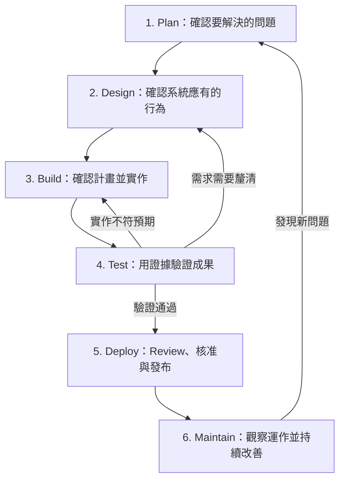

**Claude 的 AI-native SDLC：十分鐘快速導覽**

AI-native SDLC 的核心是：**Claude 參與從需求到維護的整個流程，人類負責確認方向、判斷風險，以及必要的核准。**

每個 stage 都留下下一階段能接手的成果，讓開發工作可以持續前進，同時保留可檢查的證據。[原文：The AI-Native SDLC playbook](https://claude.com/blog/the-ai-native-sdlc-playbook)

本篇使用同一個範例貫穿說明：

> **為 Go service 新增一個 Login API，接收 `username` 與 `password`。**

以下的流程概念與衡量方向整理自原文；Login API 範例與具體的階段完成條件，是協助理解的實務建議。

---

**先看全貌：人類、Claude 與自動化工具各自負責什麼？**

| 角色 | 主要責任 |
|---|---|
| **人類** | 提出問題、確認需求、決定取捨、檢查證據、核准風險 |
| **Claude** | 釐清問題、提出方案、產生文件與程式、執行檢查、分析及修正問題 |
| **自動化工具** | 按照設定執行測試、限制權限、阻擋不符條件的操作、部署與監控 |

這裡的「人類」可能是需求提出者、工程師或發布負責人；在小型團隊，也可能由同一個人擔任。

這六個 stage 並非只能單向前進。尤其 **Build 與 Test 會反覆交錯**，而不是等程式全部寫完才開始測試。

每個 stage 都要分清楚兩件事：

- **有沒有效：**採用這套做法後，交付速度與品質是否改善？需要觀察多次工作。
- **能否往下走：**這一次變更是否已具備必要的成果、證據與核准？

---

**Stage 1 — Plan：人類說清楚問題，Claude 整理意圖**

**在做什麼？**

確認「為什麼做、誰需要、希望得到什麼結果」，產出 `intent.md`。

**跟傳統開發流程有什麼不同？**  
從人類經過多次會議與轉述整理需求，轉為需求提出者直接與 Claude 討論，由 Claude 整理、人類確認。

**怎麼做？**

| 步驟 | 負責者 | 要做的事 |
|---|---|---|
| 1 | 人類 | 用人說的話描述問題，暫時不急著選技術 |
| 2 | Claude | 追問使用者、目標、限制及不做的範圍 |
| 3 | Claude | 將討論整理成 `intent.md`，列出未解問題 |
| 4 | 人類 | 修正 Claude 的誤解，決定是否接受這項需求 |

**Login API 範例**

人類提出：

> 現在使用者無法登入。我想新增一個 Login API，讓使用者提交 `username` 與 `password`，確認身分後才能使用需要登入的功能。

Claude 接著釐清：

- 帳號資料是否已經存在？
- 登入成功後，需要回傳什麼？
- 這次是否包含註冊、登出或忘記密碼？

人類確認這次只處理登入，其餘功能不在範圍內。

**如何判斷有沒有效？**

- 從提出想法到需求被清楚記錄，時間是否減少？
- 開發後是否較少出現「這不是人類原本想要的結果」？
- 人類能否根據 `intent.md` 做出採納或拒絕的決定？

**何時進入 Design？**

人類已接受 `intent.md`；問題、目標與限制清楚，尚未解決的疑問也已列出。

---

**Stage 2 — Design：Claude 提出規格，人類決定系統行為**

**在做什麼？**

將意圖轉成明確的 API 行為與設計，產出 `spec.md`。這裡的 Design 包含系統行為與技術限制，不只指畫面設計。

**跟傳統開發流程有什麼不同？**  
從需求與設計分別整理、逐次交接，轉為 Claude 在同一輪協作中整合規格並提早標出衝突，由人類決定。

**怎麼做？**

| 步驟 | 負責者 | 要做的事 |
|---|---|---|
| 1 | 人類 | 提供已接受的 `intent.md`、系統背景與團隊規範 |
| 2 | Claude | 提出 API 行為、設計選項、錯誤情境及疑問 |
| 3 | 人類 | 決定選項，處理規範衝突與重要疑問 |
| 4 | Claude | 將結果整理為 `spec.md` |
| 5 | 人類 | 確認規格符合原始目的並核准 |

**Login API 範例**

以下是一組經人類確認的範例規格：

| 項目 | 決定 |
|---|---|
| Endpoint | `POST /login` |
| Request | JSON，包含 `username`、`password` |
| 登入成功 | 回傳 `200` 與 `access_token` |
| 缺少必要參數 | 回傳 `400` |
| 帳號不存在或密碼錯誤 | 統一回傳 `401` 與相同的錯誤訊息 |
| 密碼驗證 | 依既有 password hash 機制比對 |
| Log 限制 | 不記錄 `password` 或完整 `access_token` |
| 不在本次範圍 | 註冊、忘記密碼、登出 |

Token 的效期與驗證方式等必要細節，也需要在實作前確認，不能只留下「登入成功」四個字。

**如何判斷有沒有效？**

- 從意圖到規格的時間是否縮短？
- 開始 Build 後，因規格模糊而重做的情況是否減少？
- 安全與設計問題是否更早被發現？

**何時進入 Build？**

人類已核准 `spec.md`，重要行為可以驗收，阻礙實作的疑問已解決。高風險設計由適當的技術負責人確認。

---

**Stage 3 — Build：Claude 先提計畫，人類核准後再實作**

**在做什麼？**

Claude 閱讀現有程式，提出 `plan.md`，再依人類核准的計畫修改程式與測試。

**跟傳統開發流程有什麼不同？**  
從工程師自行構思並實作，轉為 Claude 先提出可檢查的修改計畫，人類確認後由 Claude 執行。

**怎麼做？**

| 步驟 | 負責者 | 要做的事 |
|---|---|---|
| 1 | 人類 | 提供 `spec.md`，要求 Claude 使用 plan mode 分析 |
| 2 | Claude | 閱讀 codebase，列出修改檔案、順序、風險與驗證方法 |
| 3 | 人類 | 檢查計畫是否合理，要求修正並核准 |
| 4 | Claude | 按計畫實作，持續執行測試與修正 |
| 5 | Claude／人類 | Claude 說明必要的計畫變更；人類確認影響方向或風險的調整 |

**Login API 範例**

Claude 提出的計畫可能是：

1. 檢查既有 Router、帳號查詢與密碼驗證方式。
2. 新增 Login Handler，讀取並驗證參數。
3. 查詢帳號、比對 password hash。
4. 使用既定機制產生 `access_token`。
5. 補上成功、失敗與錯誤處理的測試。

人類應追問：

> 有沒有重複建立既有功能？哪一步風險最高？這次修改可能影響哪些原有 API？

**Claude 靠什麼遵守團隊做法？**

| 機制 | 用途 |
|---|---|
| `CLAUDE.md` | 提供專案背景、常用指令與重要慣例 |
| Skills | 提供特定任務需要的操作知識 |
| Hooks | 在特定動作前後執行檢查或阻擋操作 |

文件提供指引；必須強制遵守的限制，還需要 Hooks、CI 或權限控制支援。

**如何判斷有沒有效？**

- 從計畫核准到 PR 合併的時間是否縮短？
- 重做次數是否減少？
- Claude 是否減少重犯已記錄的錯誤？
- 最終程式變更是否符合核准的計畫？

**何時交給 Test／Review 驗證？**

程式已完成到可驗證的程度，附有對應測試；實作與計畫的差異已說明並確認。Test 在實作途中就應持續進行。

---

**Stage 4 — Test：Claude 執行驗證，人類檢查證據是否足夠**

**在做什麼？**

讓 Claude 在交出成果前自行檢查並修正，同時確認這些檢查真的對應人類要求的行為。

**跟傳統開發流程有什麼不同？**  
從等待後續測試回報再修正，轉為 Claude 在實作中持續驗證，並用 Evals 檢查 Agent 設定變更後的表現。

**怎麼做？**

| 步驟 | 負責者 | 要做的事 |
|---|---|---|
| 1 | 人類 | 確认驗收情境，提供可執行的 Build、Test、Lint 指令 |
| 2 | Claude | 建立或補齊測試，執行檢查並修正問題 |
| 3 | 自動化工具 | 產生實際測試結果，執行必要的限制 |
| 4 | Claude | 回報執行指令、結果，以及未驗證的部分 |
| 5 | 人類 | 檢查測試是否涵蓋需求，判斷證據是否足夠 |

**Login API 範例**

| 驗證情境 | 預期結果 |
|---|---|
| 正確的 `username`、`password` | `200`，取得可用的 `access_token` |
| 缺少 `username` 或 `password` | `400` |
| 帳號不存在 | `401` |
| 密碼錯誤 | `401`，錯誤訊息與帳號不存在時相同 |
| 使用取得的 Token 呼叫受保護 API | 能識別正確的使用者 |
| 檢查相關 Log | 不含密碼或完整 Token |

最後兩項提醒我們：**API 回傳 `200`，不代表整個登入功能就已驗證完成。**

文章也區分兩種檢查：

| 類型 | 要回答的問題 |
|---|---|
| Tests | 這次產出的 Login API 是否正確？ |
| Evals | 修改 Claude 的規則、Skills 或模型設定後，它處理代表性任務的能力是否退步？ |

**如何判斷有沒有效？**

- PR 第一次跑 CI 的通過率是否改善？
- 人類花在基本錯誤上的 Review 時間是否減少？
- 上線後才發現的缺陷是否減少？
- Agent 設定更新後，Eval 表現是否維持或改善？

**何時進入 Deploy？**

必要檢查通過，關鍵需求有實際證據，未驗證項目與已知問題已獲得適當處理。

人類需要看到實際結果，也需要確認測試標準沒有被 Claude 為了通過而削弱。

---

**Stage 5 — Deploy：Claude 準備發布，人類核准上線**

**在做什麼？**

完成 PR Review、修正回饋、發布準備與必要核准，再透過既定流程上線。

**跟傳統開發流程有什麼不同？**  
從人類承擔大量檢查與發布準備，轉為 Claude 協助 Review、修正及分析 Pipeline，人類集中判斷行為與風險。

**怎麼做？**

| 步驟 | 負責者 | 要做的事 |
|---|---|---|
| 1 | 人類 | 定義 Review 標準與必要的發布核准條件 |
| 2 | Claude | 檢查 Bug、安全問題，以及是否符合 `spec.md`、`plan.md` |
| 3 | Claude | 處理 Review 意見與失敗的檢查，準備發布資訊 |
| 4 | 人類 | 檢查重要邏輯與風險，完成必要核准 |
| 5 | 自動化工具 | 強制執行 Gate，依核准流程部署並留下紀錄 |

**Login API 範例**

Review 除了看測試通過，也要確認：

- 是否可能繞過密碼驗證？
- Token 是否代表正確的使用者？
- 是否洩漏密碼或其他敏感資訊？
- 登入失敗與異常情況是否依規格處理？

部署前還要確認：如何觀察新 API，以及發生問題時如何 Rollback。

原文保留 production 的人工授權；Claude 可以準備發布，但不能自行跳過核准 Gate。

**如何判斷有沒有效？**

- PR 等待 Review 的時間是否縮短？
- Claude 能完成多少 Review 修正？
- 更多缺陷是否在合併前被攔下？
- 交付變快時，部署失敗率與恢復時間是否仍維持良好？

**何時進入 Maintain？**

必要 Review 與發布核准完成，部署成功，上線後的基本檢查通過，監控與 Rollback 路徑已準備好。

---

**Stage 6 — Maintain：工具發現訊號，Claude 分析，人類決定處置**

**在做什麼？**

觀察真實運作，將異常與改善機會轉成下一輪可處理的工作。

**跟傳統開發流程有什麼不同？**  
從事件發生後等待人類開始調查，轉為監控或排程自動觸發 Claude 分析，再經授權的路徑推進修正。

**怎麼做？**

| 步驟 | 負責者 | 要做的事 |
|---|---|---|
| 1 | 人類 | 定義監控指標、觸發條件及 Claude 的處置權限 |
| 2 | 自動化工具 | 依明確規則偵測異常，觸發 Claude |
| 3 | Claude | 分析 Log、部署紀錄與程式，提出附有證據的診斷 |
| 4 | 人類 | 判斷應立即修正、排程處理或忽略 |
| 5 | Claude | 依授權建立 PR 或新的 `intent.md`，送回開發流程 |
| 6 | Claude／人類 | Claude 補上防止重犯的測試或 Evals，由人類確認 |

**Login API 範例**

上線後，監控發現登入 API 的 `5xx` 比例明顯增加。

Claude 檢查 Log 與最近變更，提出：

> 資料庫連線錯誤可能未被正確處理；以下是錯誤紀錄與相關程式位置。

這是**需要驗證的診斷**。人類根據證據決定處置；Claude 只能在授權範圍內開 PR，或執行事先核准的處置流程。

**如何判斷有沒有效？**

- 從異常發生到產生可處理的診斷，是否更快？
- Claude 提出的發現有多少轉成有用的修正？
- 誤報是否減少？
- 同類事故是否較少再次發生？

**何時回到 Plan？**

問題值得處理，且已整理出證據、影響與期望結果。範圍大的變更建立新的 `intent.md`；範圍小且明確的修正，可以直接進入既定 PR Review 流程。

Maintain 在系統運作期間持續進行。

---

**最後用一張表對照人類與 Claude 的交接**

| Stage | 人類主要負責 | Claude 主要負責 | 往下走的依據 |
|---|---|---|---|
| Plan | 說明問題、確認目的 | 追問、整理意圖 | 被接受的 `intent.md` |
| Design | 決定行為與取捨 | 提出規格、標出疑問 | 被核准的 `spec.md` |
| Build | 審查實作計畫 | 提出計畫、修改程式 | `plan.md` 與可驗證的變更 |
| Test | 確認驗收標準與證據 | 執行檢查、修正、回報 | 對應需求的實際結果 |
| Deploy | 判斷風險、核准發布 | 協助 Review 與發布準備 | Review、核准與部署紀錄 |
| Maintain | 決定優先順序與處置 | 分析異常、提出修正 | 有證據支持的下一輪工作 |

實際導入時，可以先由人類手動啟動各 stage。等每一步的輸入、成果與核准条件穩定，再串接自動觸發；每個階段產出的文件與紀錄，都需要能被下一階段讀取與追蹤。